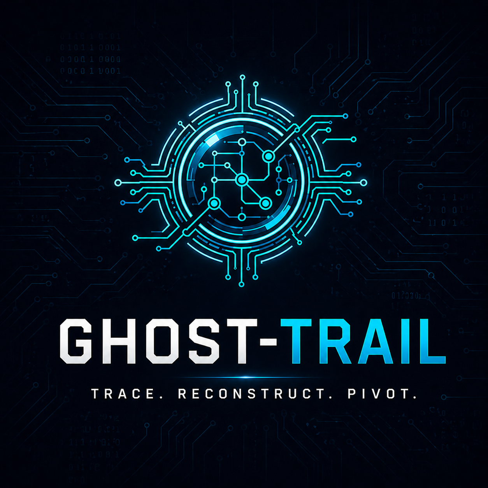

<p align="center">
  
</p>

[](LICENSE) [](https://github.com/elin-olsson/ghost-trail/actions/workflows/ci.yml)

A Linux post-intrusion forensic reconstructor that builds a chronological timeline of system activity from binary records, filesystem artifacts, and shell command histories.

## Prerequisites

- Python 3.10 or later
- Root privileges recommended for full system access
- No external runtime dependencies

Check your Python version:
```bash
python3 --version
```

## Installation

```bash
git clone https://github.com/elin-olsson/ghost-trail.git
cd ghost-trail
```

## Usage

```bash
python3 ghosttrail.py [options]
```

```bash
# Reconstruct the last 24 hours (default)
python3 ghosttrail.py

# Custom time window
python3 ghosttrail.py --hours 48

# Export timeline to JSON
python3 ghosttrail.py --json report.json

# Export interactive HTML report with timeline
python3 ghosttrail.py --html report.html

# Package forensic artifacts into a ZIP archive
python3 ghosttrail.py --collect
```

### Flags

| Flag | Description |
|---|---|
| `--version` | Print the version number and exit |
| `--hours N` | Reconstruction window in hours (default: 24) |
| `--json FILE` | Write timeline to JSON file |
| `--html FILE` | Write interactive HTML report with D3 timeline |
| `--collect` | Package artifacts into a ZIP archive for handoff |

## What it checks

| Module | Method | Purpose |
|---|---|---|
| Binary Parser | Direct `utmp`/`wtmp` decoding | Reconstructs login sessions from raw system structures |
| File Tracker | MAC timeline analysis | Identifies files modified in sensitive directories (`/tmp`, `/etc`) |
| History Engine | Multi-shell aggregation | Collects command history from all local users (bash, zsh, python) |
| Gap Detector | Auth log timestamp analysis | Flags suspicious gaps in log continuity |
| Alert Engine | Regex pattern matching (built into `ghosttrail.py`) | Flags log wiping, reverse shells, backdoor creation, data exfiltration |
| Sequence Detector | `src/sequence_detector.py` | Correlates LOGIN → suspicious command → file change into named attack sequences; raises risk score |
| Evidence Collector | ZIP packaging (`src/evidence_collector.py`) | Packages forensic artifacts into an archive for handoff (`--collect`) |

## Example output

```
══════════════════════════════════════════════════════════════
  GHOST-TRAIL  —  Forensic Timeline Reconstructor
══════════════════════════════════════════════════════════════
  Target:     Local System
  Window:     Last 24 hours
  Generated:  2026-04-25 16:45:00
══════════════════════════════════════════════════════════════

  2026-04-25 09:12:04  LOGIN     User 'fox' session from 192.168.1.50
  2026-04-25 09:14:22  FILE      Modified: /tmp/.hidden_payload (1240 bytes)
  2026-04-25 09:15:10  ALERT     CRITICAL: User 'fox' ran suspicious command: rm -rf /var/log/auth.log
  2026-04-25 09:18:33  LOGIN     User 'root' session from localhost

══════════════════════════════════════════════════════════════
```

## Dependencies

No runtime dependencies — stdlib only.

| Package | Version | Purpose |
|---|---|---|
| `pytest` | ≥ 9.0 | Test suite only — not required at runtime |

---

<p align="center">
  <sub>The logo is &copy; 2026 shadowfox.se — all rights reserved, not covered by the MIT license.</sub>
</p>